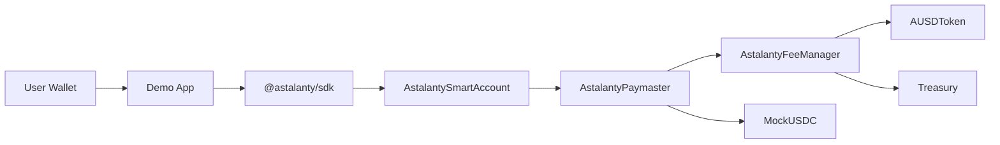

# Astalanty

Astalanty is an open source technical MVP for a developer-facing payment abstraction layer designed for the Arbitrum ecosystem.

The current MVP demonstrates a simple but important flow: a user interacts through a Smart Account, pays with Mock USDC, the Paymaster sponsors the operation, the Fee Manager calculates settlement, and AUSD records the internal fee settlement.

This repository contains the working MVP package:

- Solidity contracts for the economic core;
- Smart Account and Factory;
- Paymaster and Fee Manager;
- Hardhat tests for the complete flow;
- deploy and seed scripts;
- official TypeScript SDK;
- demo web app built exclusively on the SDK;
- public landing site.

The public objective is not to present a complete production blockchain yet. The objective is to prove the core Astalanty thesis with a small, inspectable and testable MVP.

## Problem

Blockchain applications often expose users and developers to fragmented gas, account and payment flows. A developer building on L2/L3 infrastructure usually needs to understand contracts, fee payment mechanics, account abstraction details and network-specific deployment details before they can demonstrate a simple sponsored transaction.

Astalanty reduces this complexity by isolating the economic flow behind modular contracts and a canonical SDK. Applications should interact with Astalanty through the SDK, not by manually orchestrating Solidity contracts.

## MVP Solution

The MVP shows a sponsored transaction flow using:

- `MockUSDC`: testnet ERC-20 representing the user-facing payment asset;
- `AUSDToken`: testnet ERC-20 representing Astalanty internal settlement;
- `AstalantyFeeManager`: deterministic fee quote and settlement policy;
- `AstalantyPaymaster`: receives Mock USDC and triggers AUSD settlement;
- `AstalantySmartAccount`: minimal self-custodial Smart Account;
- `AstalantySmartAccountFactory`: one Smart Account per owner for the MVP;
- `@astalanty/sdk`: canonical TypeScript API;
- `apps/demo`: official technical demo app.

## Current MVP Status

Implemented and validated:

- MVP economic contracts compile with Hardhat.
- Smart Account and Factory are implemented.
- End-to-end Hardhat tests pass.
- Deploy and seed scripts exist for local Hardhat and Arbitrum Sepolia.
- SDK TypeScript package builds and exposes the canonical MVP API.
- Demo App uses only the SDK for blockchain interaction.
- Landing site is separated from the Demo App in `apps/site`.
- Local deployment JSON exists for evidence and front-end defaults.

Temporarily pending:

- Public Arbitrum Sepolia deployment, blocked only by testnet ETH availability.
- Explorer verification links for public contracts.
- Public deployment evidence using real Arbitrum Sepolia contract addresses.

## Quick Architecture



More detail:

- [ADR Summary](docs/architecture/ADR_SUMMARY.md)
- [Quick Architecture](docs/public/QUICK_ARCHITECTURE.md)
- [MVP Flow](docs/public/MVP_FLOW.md)
- [Technical Evidence Checklist](docs/public/TECHNICAL_EVIDENCE_CHECKLIST.md)

## How To Run Locally

Install dependencies:

```powershell
git clone https://github.com/Nimbus-oficial/Astalanty.git
cd Astalanty
pnpm install
```

Build and test contracts:

```powershell
cd packages/contracts
pnpm build
pnpm test
```

Run local deploy and seed:

```powershell
cd packages/contracts
pnpm deploy:local
```

Build SDK:

```powershell
cd ../..
pnpm --filter @astalanty/sdk build
```

Run Demo App:

```powershell
pnpm --filter @astalanty/demo dev
```

Open:

```text
http://localhost:3000
```

Run landing site:

```powershell
pnpm --filter @astalanty/site dev
```

## Repository Layout

```text
apps/
  demo/                Official MVP technical demo app
  site/                Public landing site for astalanty.com

packages/
  contracts/           Solidity contracts, tests and deploy scripts
  sdk/                 Official TypeScript SDK

docs/
  architecture/        Public ADR summary
  public/              Public technical overview docs
  specifications/      Frozen technical specifications
  operations/          Deployment and operational runbooks
```

Future modules such as public APIs, explorer, bridge, NOC, wallet and infrastructure automation are intentionally not included in this public MVP package. They remain roadmap items, not implemented features.

## Technical Milestones

Completed:

- MVP scope frozen.
- Economic core contracts implemented.
- Smart Account and Factory implemented.
- Paymaster safety rule enforced: `payer == account`.
- Hardhat test suite validates the full flow.
- Deploy and seed script generates deployment JSON.
- SDK abstracts contract interaction for applications.
- Demo App consumes the SDK only.
- Public documentation package created.

Next milestones:

- Deploy to Arbitrum Sepolia.
- Save Arbiscan links for each contract and transaction.
- Verify contracts on Arbiscan Sepolia.
- Record a short walkthrough of the Demo App.
- Publish a technical evidence package with verified addresses and transaction links.

## Known Limitations

- The MVP uses `sponsorDemoOperation`, not a complete ERC-4337 EntryPoint/Bundler production flow.
- AUSD and Mock USDC are testnet ERC-20 contracts only.
- The current public deployment is pending Arbitrum Sepolia testnet ETH.
- The Demo App has no backend, database, auth, user management or production wallet features.
- The Paymaster and Fee Manager are intentionally centralized/admin-controlled for the MVP testnet phase.
- Explorer, bridge, NOC, public APIs and full Orbit chain operations are outside this MVP package.

## Why Arbitrum

Astalanty is designed around the Arbitrum Orbit direction: modular execution, application-specific chains and developer-friendly infrastructure. The MVP focuses on the developer experience around account/payment abstraction, a useful primitive for teams building applications that want to reduce user friction while preserving self-custody and modular settlement.

The current MVP is intentionally small: it gives developers and technical reviewers working contracts, tests, SDK code and a demo app rather than only diagrams.
