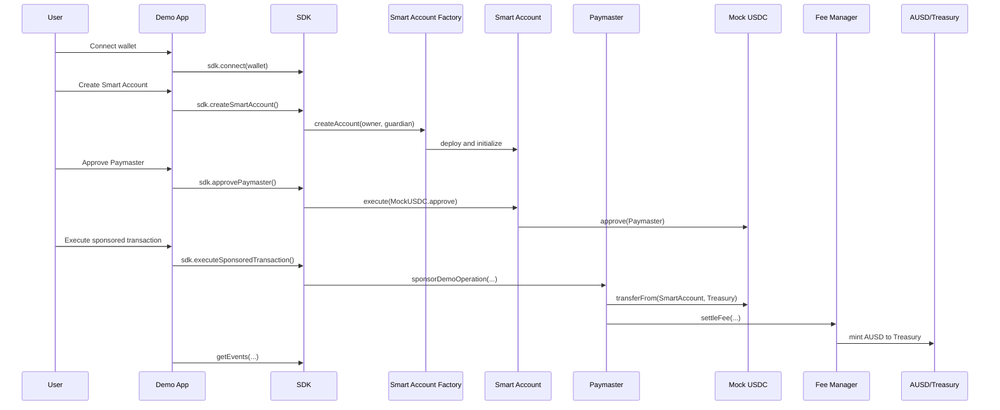

# Astalanty MVP Flow

## Objective

Demonstrate that an application can use the Astalanty SDK to create or connect a Smart Account, approve a Paymaster and execute a sponsored operation where Mock USDC is collected and AUSD settlement is recorded.

## End-To-End Flow



## What The Demo Proves

- The front-end can operate without direct contract calls.
- The SDK can orchestrate the MVP contracts.
- A Smart Account can approve token spending through its execution function.
- Paymaster sponsorship can be demonstrated with `sponsorDemoOperation`.
- Fee Manager can compute a quote and settle AUSD.
- Events can be queried for technical evidence.

## Contract Test Coverage

The Hardhat test suite validates:

- deployment of all MVP contracts;
- Smart Account creation;
- duplicate Smart Account prevention;
- mint of Mock USDC to Smart Account;
- approval of Paymaster through Smart Account;
- sponsored operation execution;
- Fee Manager settlement;
- AUSD mint to treasury;
- primary events;
- rejection of `payer != account`.

Test file:

```text
packages/contracts/test/mvp-flow.test.cjs
```

## SDK Flow

```ts
const sdk = new AstalantySDK(config);

await sdk.connect(wallet);
await sdk.createSmartAccount();
await sdk.getMockUSDCBalance();
await sdk.getAUSDBalance();
await sdk.getFeeManagerParameters();
await sdk.approvePaymaster();
await sdk.executeSponsoredTransaction();
await sdk.getEvents({ event: "PaymasterFeeSettled" });
```

## Demo App Flow

The official demo app exposes the flow as a single screen:

- connection status;
- Connect Wallet;
- Create Smart Account;
- balances;
- Paymaster and Fee Manager data;
- Execute Sponsored Transaction;
- operation logs;
- recent events.

Screenshot:

```text
apps/demo/demo-screenshot-viewport.png
```
