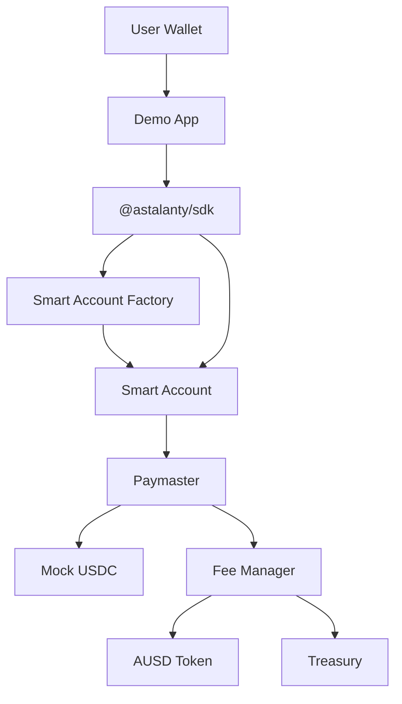

# Astalanty Quick Architecture

## Executive Summary

Astalanty is a modular MVP that demonstrates payment abstraction for a future Arbitrum Orbit-oriented infrastructure stack.

The current implementation is intentionally narrow. It proves the economic core: Smart Account execution, Paymaster sponsorship, deterministic fee calculation and AUSD settlement.

## Components

| Component | Status | Responsibility |
| --- | --- | --- |
| `MockUSDC` | Implemented | Testnet ERC-20 used as the user-facing payment token. |
| `AUSDToken` | Implemented | Testnet ERC-20 used as the internal settlement token. |
| `AstalantyFeeManager` | Implemented | Calculates fee quotes and settles AUSD to treasury. |
| `AstalantyPaymaster` | Implemented | Collects Mock USDC and calls Fee Manager settlement. |
| `AstalantySmartAccount` | Implemented | Minimal self-custodial account with authorized execution. |
| `AstalantySmartAccountFactory` | Implemented | Creates one Smart Account per owner for the MVP. |
| `@astalanty/sdk` | Implemented | Canonical TypeScript interface for apps. |
| `apps/demo` | Implemented | Official demo app using only the SDK. |

## Architecture Diagram



## Design Boundaries

- The Demo App must not call Solidity contracts directly.
- Application integration must go through `@astalanty/sdk`.
- The SDK is responsible for hiding contract orchestration.
- Contracts remain modular so later phases can replace the demo flow with a fuller Account Abstraction implementation.

## Current Deployment Boundary

The MVP is locally deployable and Arbitrum Sepolia-ready. Public Sepolia deployment is pending testnet ETH.

Generated deployment files are stored in:

```text
packages/contracts/deployments/
```

## Not Included In This MVP

- Production ERC-4337 bundler integration.
- Native Arbitrum Orbit gas token behavior.
- Bridge.
- Explorer.
- NOC.
- Backend APIs.
- Wallet product.
- Mainnet deployment.
